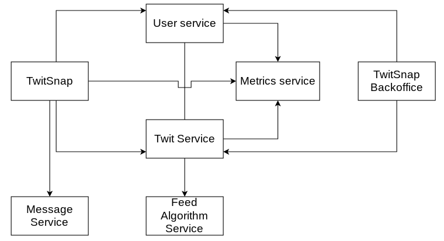

This site holds the complete documentation for the services used for the development of the Twitsnap mobile app for Android.

## Currently maintained by:

|  |  |  |  |
|:---:|:---:|:---:|:---:|
| **Juan Manuel Pascual Osorio**  | **Maximiliano Nicolas Otero Silvera**  | **Martin Juan Cwikla**   | **Luis Escalante**   |

## Architecture

This project was developed using a microservices architecture.

## User Manual

-   [TwitSnap user manual](user-manual/)

## Frontend

-   [Mobile App](user-manual/)
-   [Backoffice Web](backoffice-web/)

## Backend

-   [Twits Service](twits-service/)
-   [Users Service](users-service/)
-   [Feed Algorithm Service](algo-feed-service/)
-   [Metrics Service](metrics-service/)
-   [Message Service](message-service/)

## Postmortem

-   [Postmortem](postmortem/)
