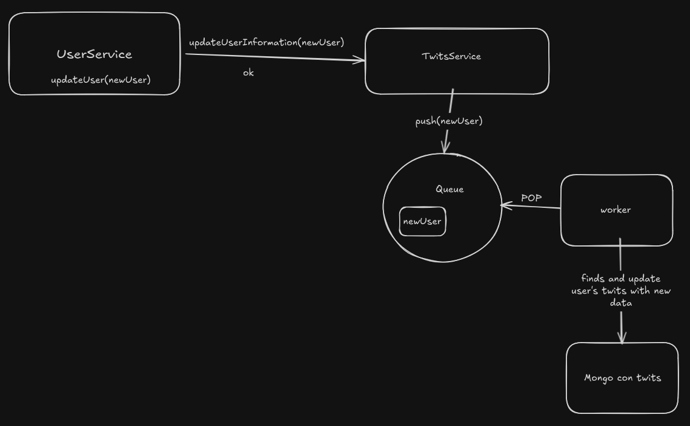

# Postmortem

## Lo que salió bien

### Planificación

-   La separación de roles y la división de tareas fue bastante clara y efectiva en cuanto a los conocimientos de cada uno.
-   Se cumplieron con los tiempos y objetivos definidos.

### Tecnología

-   React Native y Expo fueron una buena elección para el desarrollo de la app debido a que permitieron un desarrollo multiplataforma y facilidad de implementación con una curva de aprendizaje más baja frene a otras tecnologías.
-   Node.js y Python fueron buenas elecciones para los servicios debido a que ambos son lenguajes que todos los miembros del equipo tenían conocimientos previos y eran fáciles de desarollar.

### Colaboración en equipo

-   Hubo buena comunicación y asignación de tareas.
-   Buen uso de las herramientas de comunicación y trabajo en equipo como Discord, GitHub, etc.
-   Integración mediante pull requests.

### Recepción del proyecto

-   Los usuarios y evaluadores fueron muy positivos con el proyecto.
-   La app no presentó inconvenientes durante la presentación en vivo.

## Lo que salió mal

### Escalabilidad

Aunque en general la arquitectura de microservicios implementada fue bastante buena, hay algunas features que por el tiempo de desarrollo para el proyecto tuvimos que acotar la complejidad de la solución, por ejemplo:

-   Las notificaciones de trending topics, que avisa a todos los usuarios de la app.
-   En la edición de perfil, si se modificaba algún dato contenido dentro del objeto twit, se pudiera encolar este cambio para modificar todos los twits de ese usuario, este caso lo diseñamos pero no lo implementamos.

### Design System

En general quedó bastante consistente la UI/UX de la app, pero para ello hubo mucho "Copy-Paste" entre componentes ya que no se definió un design system donde cada componente tuviera el diseño predefinido.

### Métricas y gráficos

Se pudo implementar las gráficas y métricas necesarias en el backoffice y app pero se pudo haber aprovechado de mejor manera las librerías de gráficos para una mejor experiencia de visualización.
