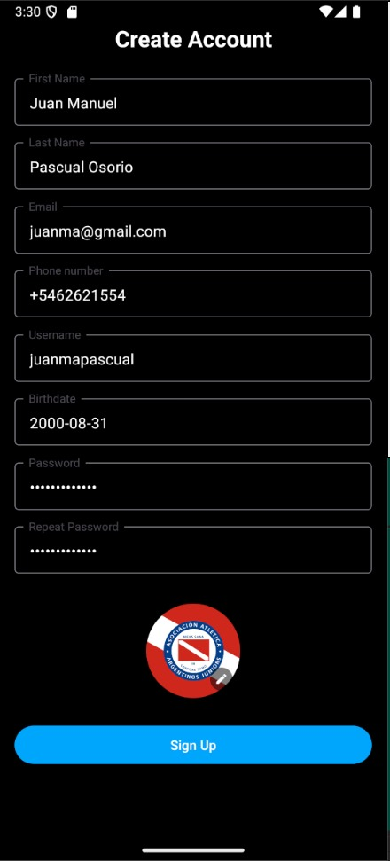

# User Manual

This manual explains some of the core functionalities of the Mobile App.

## Landing
This is the first screen you'll see when you open the app. 
The App allows for normal user registration and login, as well as Google login.


## Registering
When you tap on the register button, you'll be taken to the registration screen. 
There are multiple ways to create a Twitsnap account:
- Using your email and password and filling in the required fields.



- Using your Google account.


## Home
This is the main screen of the app. It shows the user's feed, which is a list of twits from the users they follow, their own twits and some recommended twits.
Using the tab bar at the bottom, the user can navigate to the following screens:
- Home
- Search
- Notifications
- Messages
- Metrics
Twits from the feed can be divided into two categories: Twits from the sources mentioned above or restrict it to twits from people currently followed by the user.
Tapping on your profile picture will take you to your profile.


## Twit inspection


When you tap on a twit, you'll be taken to the twit inspection screen. Here you can see the twit's content, the user who posted it, the number of likes, comments and bookmarks, and the comments themselves.
You can also like, comment, bookmark or share thw twit with other people using apps like WhatsApp, Instagram or Twitter/X.


On this view, twits can also be deleted or edited only by the user who posted them.

## Profile
In your profile, you're able to see your custom profile, your twits, retwits, bookmarks, followers and following.
People who visit your profile can also see the data about you and follow you.


User's profile is fully customizable, allowing for changing the profile picture, the cover picture, username, etc.


Setting your profile private makes so that only people who you follow can access both people you follow and your followers.

## Search

The search screen allows you to search for users, twits, hashtags, etc.


It also features a list of trending topics and users to follow given the people your friends follow.


## Messages


The messages screen allows you to chat with other users you follow. You can send them text messages, edit them or delete them.


## Notifications

Notifications for interactions with other users or twits that are trending are shown here.


## Metrics

The metrics screen allows you to see some of the data of your usage of the app, such as the number of twits you've posted, the number of likes you've given, the number of comments you've made, etc.

## Verification

The app allows for user verification, which is a way to prove that you are who you say you are.
This can be done via receiving a code on your email or phone number.


## Final notes

That's pretty much all you need to know about Twitsnap.

If you have any questions or suggestions, feel free to contact us.

Enjoy your Twitsnap experience!
```
¡¡¡ GL HF !!!
```