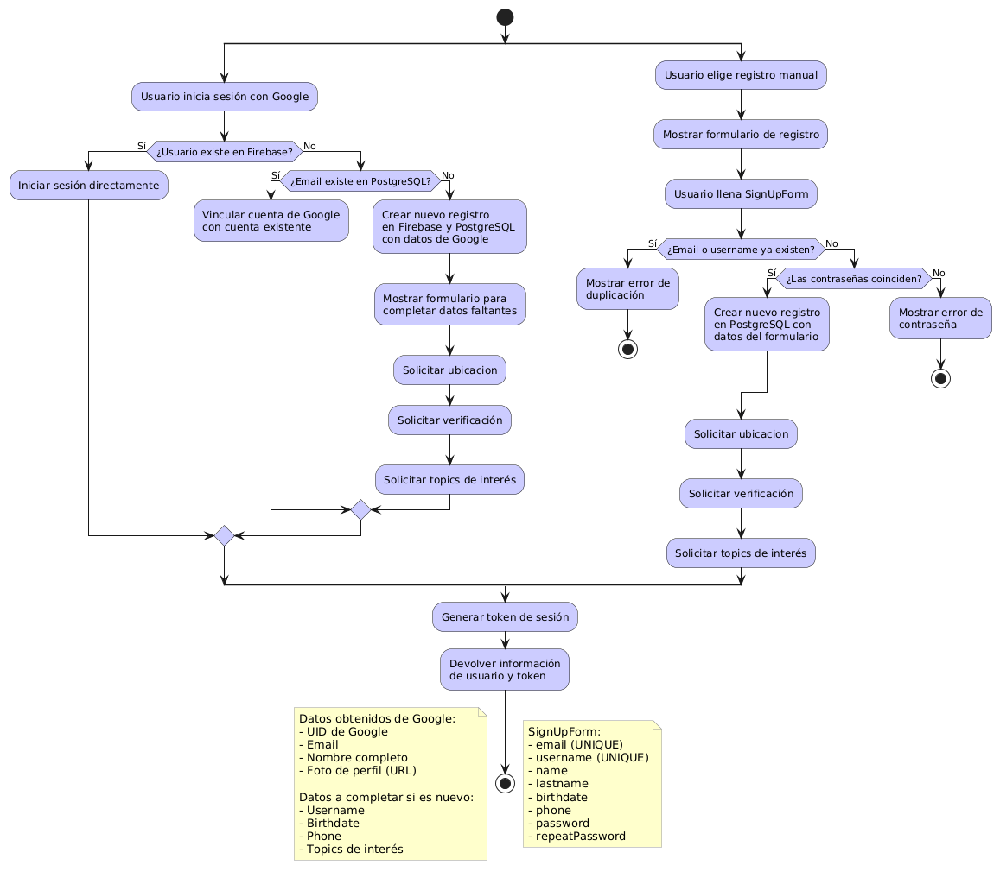

# Requirements

-   NodeJS 20
-   Docker 27.3.1
-   Docker-compose 2.6.0
-   Firebase project serviceAccountKey.json
-   Firebase googleCredentials.json

# Install

First, clone the repository

```bash
git clone https://github.com/Twit-Snap/users_service.git
```

or

```bash
git clone git@github.com:Twit-Snap/users_service.git
```

Then, if you want to install the requirements to continue with the development run:

```bash
npm i
```

# Run it

### Run in development

```bash
npm run dev
```

### Run in production

#### Build

```bash
npm run build
```

#### Run

```bash
npm run start
```

### Run linter

```bash
npm run lint
```

### Run tests

#### Run

```bash
npm run test
```

#### Coverage

```bash
npm run coverage
```

# Secrets and environment variables

DATABASE_URL: Url to postgresql database, default = postgres://myuser:mypassword@db:5432/twitsnap_users. If you want to modify it, you can do so in docker-compose.yaml

TWILIO_AUTH_TOKEN: Twilio auth token to send sms and email verifications

USER_SERVICE_URL: Url to this service

TWITS_SERVICE_URL: Url to twitsnap twits service

METRICS_SERVICE_URL: Url to twitsnap metrics service (optional)

JWT_SECRET_KEY: JWT generator key

SMTP_API_KEY: Your Emblue email api key as a JWT token

### Firebase

You must need to configure SECRET_ACCOUNT_KEY with serviceAccountKey.json file content in base64 encode. Same for GOOGLE_APPLICATION_CREDENTIALS_JSON secret.

### New Relic

If you want to use New Relic to monitor the service, you must need to configure the secrets NEW_RELIC_APP_NAME and NEW_RELIC_LICENSE_KEY

# Architecture

This service has the following architecture:

-   Controller layer: Validates data received from HTTP requests
-   Service layer: Bussiness logic and communicates with the repository
-   Repository layer: Makes queries to the postgresql database


# Auth flow



# Open API specification

```yaml
---
openapi: 3.1.0
info:
    title: Users service
    description: Service to manage twitsnapp users
    version: 1.0.0
paths:
    "/auth/login":
        post:
            description: ""
            responses:
                default:
                    description: ""
    "/auth/register":
        post:
            description: ""
            responses:
                default:
                    description: ""
    "/auth/verify":
        post:
            description: ""
            responses:
                default:
                    description: ""
    "/auth/forgot-password":
        post:
            description: ""
            responses:
                default:
                    description: ""
    "/auth/reset-password":
        post:
            description: ""
            responses:
                default:
                    description: ""
    "/users/":
        get:
            description: ""
            parameters:
                - name: has
                  in: query
                  type: string
                - name: createdAt
                  in: query
                  type: string
                - name: limit
                  in: query
                  type: string
                - name: amount
                  in: query
                  type: string
                - name: offset
                  in: query
                  type: string
                - name: equalDate
                  in: query
                  type: string
            responses:
                "200":
                    description: OK
    "/users/interests":
        get:
            description: ""
            responses:
                "200":
                    description: OK
        post:
            description: ""
            parameters:
                - name: body
                  in: body
                  schema:
                      type: object
                      properties:
                          interests:
                              example: any
            responses:
                "200":
                    description: OK
    "/users/{username}":
        get:
            description: ""
            parameters:
                - name: username
                  in: path
                  required: true
                  type: string
                - name: reduce
                  in: query
                  type: string
                - name: suggestAccounts
                  in: query
                  type: string
                - name: limit
                  in: query
                  type: string
            responses:
                "200":
                    description: OK
        patch:
            description: ""
            parameters:
                - name: username
                  in: path
                  required: true
                  type: string
                - name: body
                  in: body
                  schema:
                      type: object
                      properties:
                          isBlocked:
                              example: any
            responses:
                "200":
                    description: OK
    "/users/{username}/followers":
        post:
            description: ""
            parameters:
                - name: username
                  in: path
                  required: true
                  type: string
                - name: body
                  in: body
                  schema:
                      type: object
                      properties:
                          followedUsername:
                              example: any
            responses:
                "201":
                    description: Created
        delete:
            description: ""
            parameters:
                - name: username
                  in: path
                  required: true
                  type: string
                - name: body
                  in: body
                  schema:
                      type: object
                      properties:
                          followedUsername:
                              example: any
            responses:
                "204":
                    description: No Content
    "/users/{username}/followers/":
        get:
            description: ""
            parameters:
                - name: username
                  in: path
                  required: true
                  type: string
                - name: byFollowers
                  in: query
                  type: string
                - name: has
                  in: query
                  type: string
                - name: createdAt
                  in: query
                  type: string
                - name: limit
                  in: query
                  type: string
            responses:
                "200":
                    description: OK
    "/users/{username}/followers/{followedUsername}":
        get:
            description: ""
            parameters:
                - name: username
                  in: path
                  required: true
                  type: string
                - name: followedUsername
                  in: path
                  required: true
                  type: string
            responses:
                "200":
                    description: OK
    "/users/location":
        post:
            description: ""
            parameters:
                - name: body
                  in: body
                  schema:
                      type: object
                      properties:
                          latitude:
                              example: any
                          longitude:
                              example: any
            responses:
                default:
                    description: ""
    "/users/notifications":
        post:
            description: ""
            parameters:
                - name: body
                  in: body
                  schema:
                      type: object
                      properties:
                          title:
                              example: any
                          body:
                              example: any
                          data:
                              example: any
            responses:
                default:
                    description: ""
    "/admins/users":
        get:
            description: ""
            parameters:
                - name: has
                  in: query
                  type: string
                - name: createdAt
                  in: query
                  type: string
                - name: offset
                  in: query
                  type: string
            responses:
                "200":
                    description: OK
    "/admins/users/{username}":
        get:
            description: ""
            parameters:
                - name: username
                  in: path
                  required: true
                  type: string
            responses:
                "200":
                    description: OK
    "/auth/admins/register":
        post:
            description: ""
            responses:
                "201":
                    description: Created
    "/auth/admins/login":
        post:
            description: ""
            responses:
                "200":
                    description: OK
    "/auth/sso/login":
        post:
            description: ""
            responses:
                default:
                    description: ""
    "/auth/sso/register":
        post:
            description: ""
            responses:
                default:
                    description: ""
    "/public/interests":
        get:
            description: ""
            responses:
                "200":
                    description: OK
    "/redirect/{path}":
        get:
            description: ""
            parameters:
                - name: path
                  in: path
                  required: true
                  type: string
            responses:
                default:
                    description: ""
```
